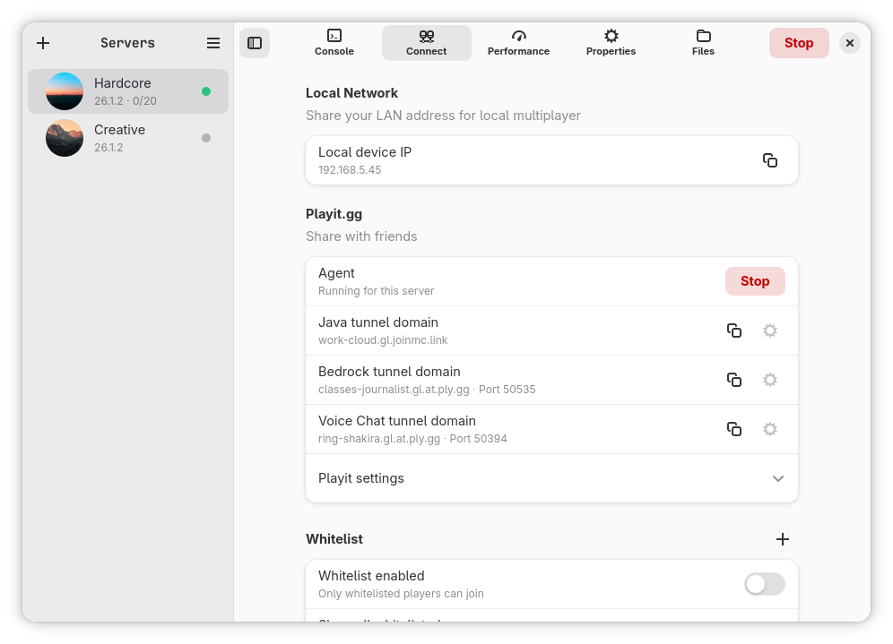

<p align="center">
  
</p>

<h1 align="center">Niksnaks-Hosting</h1>

<p align="center">
  Host Minecraft servers
  <br><br>
  <a href="https://flathub.org/en/apps/com.niksnakshosting.NiksnaksHosting"></a>
  <a href="LICENSE"></a>
  
</p>

Niksnaks-Hosting is a desktop app for creating, running, and managing Minecraft Fabric servers. It wraps the full life of a server — from first install to daily operation — behind a clean native UI built with GTK4 and libadwaita, so you rarely need to touch a terminal.

## What it does

- **Set up a server in a few clicks.** Create a new Fabric server and let Niksnaks-Hosting download the loader, the Minecraft version files, and the matching Java runtime when your system is missing one.
- **Run and control.** Start and stop servers, send commands, and follow the live console log without leaving the app.
- **Watch performance.** A live performance view shows CPU and memory usage so you can tell when a server is struggling.
- **Edit server properties.** A graphical editor for `server.properties` with autosave, including an offline-mode toggle, Java version selection, and custom JVM arguments.
- **Manage worlds and files.** Browse the server folder, import and switch worlds, and clean up dimensions.
- **Install mods from Modrinth.** Browse Modrinth inside the app, install mods, and let Niksnaks-Hosting pull in their dependencies automatically.
- **Back up and restore.** Create world backups and restore them when something breaks; old backups are removed automatically after 30 days.
- **Let friends connect.** Built-in Playit support lets you host without manual port forwarding, plus whitelist and ban-list management.
- **Run more than one server.** Multiple servers can run at the same time from the same window.

## Get Niksnaks-Hosting
[](https://flathub.org/en/apps/com.niksnakshosting.NiksnaksHosting)

- **Linux:** install the Flatpak from [Flathub](https://flathub.org/en/apps/com.niksnakshosting.NiksnaksHosting).
- **Windows:** download the Windows installer from the releases.

<details>
<summary>Run from source (Python)</summary>

### Linux

1. Install GTK4/libadwaita and PyGObject system packages.
2. Install the Python dependencies:

```bash
python3 -m pip install requests psutil Pillow
```

3. Run Niksnaks-Hosting:

```bash
python3 niksnaks_hosting.py
```

### Windows

The Windows build uses the same GTK/libadwaita UI as Linux, so it needs a Python environment that already has PyGObject (`gi`), GTK4, and libadwaita.

Recommended MSYS2 UCRT64 setup:

```bash
pacman -Suy
pacman -S mingw-w64-ucrt-x86_64-python mingw-w64-ucrt-x86_64-python-gobject mingw-w64-ucrt-x86_64-python-requests mingw-w64-ucrt-x86_64-python-psutil mingw-w64-ucrt-x86_64-python-pillow mingw-w64-ucrt-x86_64-gtk4 mingw-w64-ucrt-x86_64-libadwaita
```

Then run from the MSYS2 UCRT64 shell:

```bash
python niksnaks_hosting.py
```

Conda is also supported if the environment includes `pygobject` and `gtk4`.

</details>

<details>
<summary>Build the Windows installer</summary>

The Windows installer is a PyInstaller bundle (app + GTK4/libadwaita runtime) wrapped with Inno Setup.

1. Install the toolchain:

```powershell
winget install MSYS2.MSYS2
winget install JRSoftware.InnoSetup
```

2. From an MSYS2 **UCRT64** shell, install the build dependencies:

```bash
pacman -S --needed mingw-w64-ucrt-x86_64-gtk4 mingw-w64-ucrt-x86_64-libadwaita mingw-w64-ucrt-x86_64-python mingw-w64-ucrt-x86_64-python-gobject mingw-w64-ucrt-x86_64-python-requests mingw-w64-ucrt-x86_64-python-psutil mingw-w64-ucrt-x86_64-python-pillow mingw-w64-ucrt-x86_64-librsvg mingw-w64-ucrt-x86_64-adwaita-icon-theme mingw-w64-ucrt-x86_64-python-pip
python -m pip install --break-system-packages pyinstaller
```

3. Build:

```bash
./packaging/windows/build.sh
```

This writes `dist/Niksnaks-Hosting/` (portable folder) and `dist/Niksnaks-Hosting-<version>-Setup.exe`.

Set `NIKSNAKS_CONSOLE=1` before building to get a console window for debugging startup errors.

</details>

<details>
<summary>Build the Linux Flatpak bundle</summary>

Requires Linux (or WSL) with `flatpak` and `flatpak-builder`:

```bash
sudo apt install flatpak flatpak-builder   # or: sudo dnf install flatpak flatpak-builder
./packaging/flatpak/build.sh
```

This writes `dist/Niksnaks-Hosting-<version>.flatpak`, installable with:

```bash
flatpak install --user ./dist/Niksnaks-Hosting-<version>.flatpak
```

</details>

## Screenshots

<p align="center">
	
</p>

- Console: stream logs and send commands.

<p align="center">
	
</p>

- Performance: monitor live server performance.

<p align="center">
	
</p>

- Properties: edit server settings with autosave.

<p align="center">
	
</p>

- Files: manage worlds, dimensions, and backups.

<p align="center">
	
</p>

- Mods: browse Modrinth, install mods, and auto-manage dependencies.

<p align="center">
	
</p>

- Connect: configure Playit and manage whitelist/ban lists.

<p align="center">
	
</p>

- Backups: create and restore world backups.