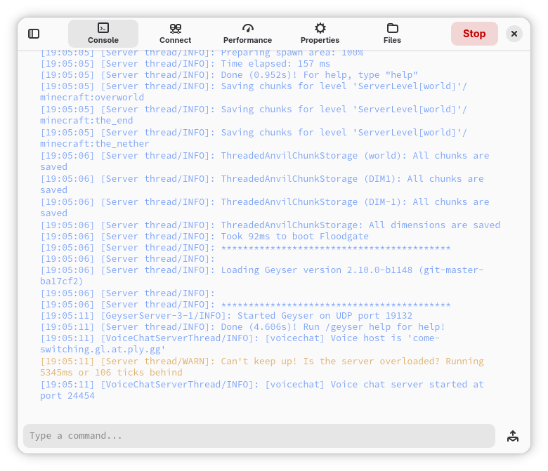
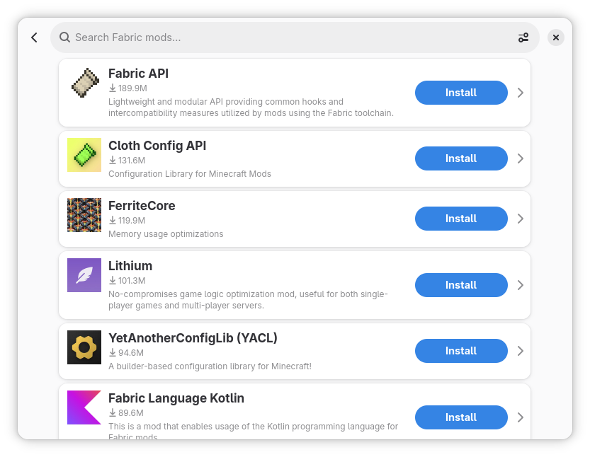
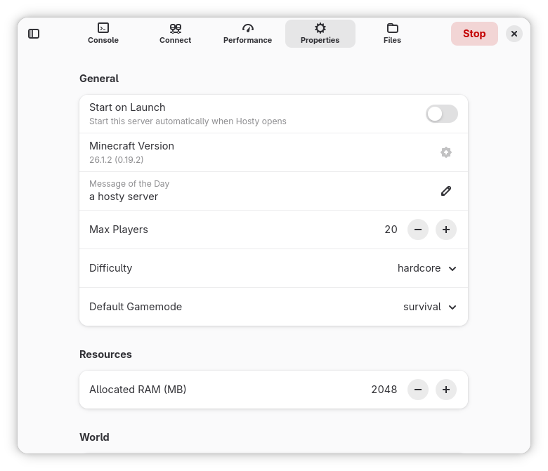
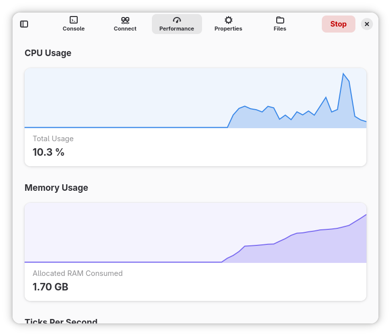
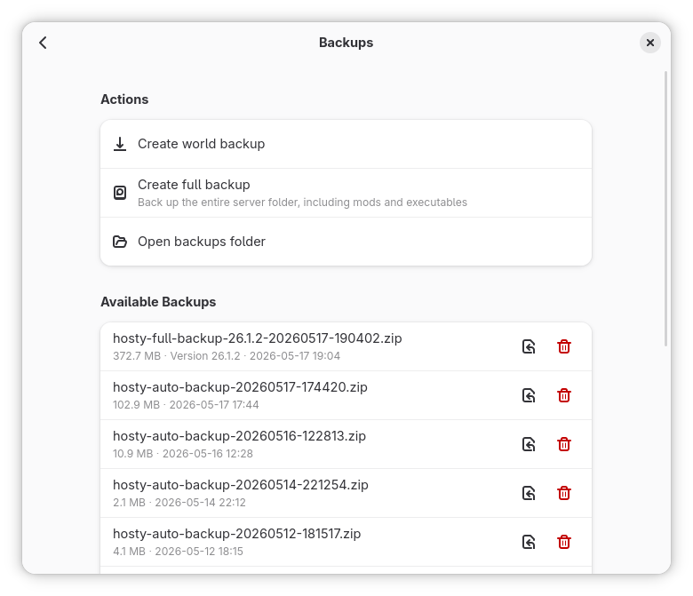
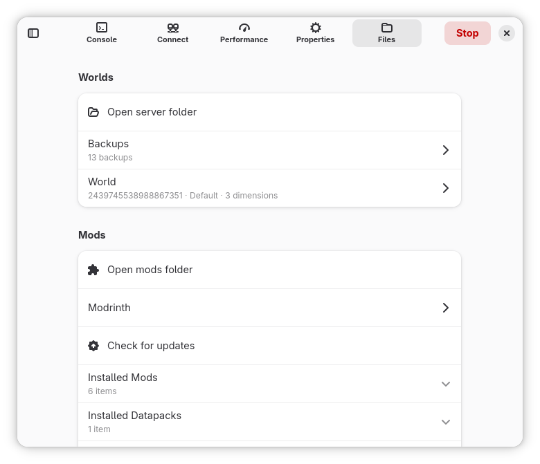

# Niksnaks-Hosting

> Host Minecraft servers on Linux — without the technical hassle.

Niksnaks-Hosting is a graphical application that simplifies creating and managing
Minecraft servers. It removes the usual technical barriers by automating the
installation of server files and handling the required Java runtimes for you, so you
can focus on playing instead of wrangling the command line.

Built with Python and GTK 4 / libadwaita, it fits naturally into the GNOME desktop.

## Features

- **One-click server setup** — install server files and the matching Java runtime
  automatically; run multiple servers side by side.
- **Java or Bedrock** — pick the edition when you create a server. Bedrock servers use
  Mojang's Dedicated Server build and get the same console, backups, allow list, and
  properties editor, tuned to Bedrock's own settings.
- **Version picker** — choose a Minecraft version, then pick any Fabric loader or Forge
  build published for it, with the recommended one selected by default.
- **Built-in Modrinth browser** — discover and install mods and modpacks straight from
  the app.
- **Playit tunnel support** — host without manual port forwarding and share your local
  server with friends.
- **Server console & logs** — watch server output live and send commands.
- **Performance monitoring** — keep an eye on CPU, memory, and uptime.
- **Properties editor** — edit `server.properties` through a graphical form.
- **Backups** — create and restore server backups, with auto-deletion after 30 days.
- **World files** — manage worlds and import existing ones.
- **Java control** — pick a Java version and set custom JVM arguments per server.
- **Offline mode** — run servers in offline mode when you need to.
- **Internationalization** — ships with English and Polski (Polish), with more welcome.
  See [CONTRIBUTING.md](CONTRIBUTING.md) to add your language.

## Screenshots

<p float="left">
  
  
  
</p>
<p float="left">
  
  
  
</p>

## Requirements

- Python **3.13** or newer
- GTK 4, libadwaita, and PyGObject
- Java runtime(s) — managed by the app on a per-server basis
- Python dependencies: `requests`, `psutil`, `Pillow`

## Installation

### Flatpak (recommended on Linux)

The easiest way to get Niksnaks-Hosting on Linux is the Flatpak bundle. Build it from
source with the included helper script:

```bash
./packaging/flatpak/build.sh
flatpak install --user dist/Niksnaks-Hosting-*.flatpak
```

This pulls in the GNOME runtime and required Python modules, then produces a bundle in
`dist/`.

### Build from source (Meson)

Niksnaks-Hosting uses Meson as its build system:

```bash
meson setup build
ninja -C build
meson install -C build      # installs to the configured prefix
```

This installs the `niksnaks-hosting` command, the desktop entry, icons, metainfo, and
compiled translations.

### Windows

A frozen Windows build is supported via PyInstaller. On Windows, GTK4/libadwaita and
PyGObject must come from the same Python environment (MSYS2 UCRT64 or Conda). The app
auto-detects the bundled GTK/GObject runtime at launch.

### Run from source (development)

```bash
pip install requests psutil pillow
python niksnaks_hosting.py
```

> On Windows, run it with the Python that has GTK4/libadwaita and PyGObject installed.

## Usage

Launch **Niksnaks-Hosting** from your application menu, or run `niksnaks-hosting` from a
terminal. Create a new server, choose Java or Bedrock Edition, pick a version, and the app
handles the rest — downloading files, setting up Java, and starting the server. From there
you can install mods from Modrinth, configure a Playit tunnel, watch the console, tweak
properties, and take backups.

Bedrock servers run Mojang's Bedrock Dedicated Server, which is a native binary rather than
a Java program: there is no loader, no heap size, and no Modrinth mods, and the app hides
those options accordingly. Bedrock players connect over UDP on the server's own port
(19132 by default), which the Connect view spells out next to your local IP.

Keyboard shortcuts are listed under the in-app **Shortcuts** dialog.

## Translations

Niksnaks-Hosting uses Python's standard `gettext` for i18n; translatable strings are
marked with `_("...")` in the source. To add or update a translation, follow the steps in
[CONTRIBUTING.md](CONTRIBUTING.md) (generate the `.pot`, create/update a `.po`, add your
locale to `po/LINGUAS`, and submit it with your patch).

## Contributing

Contributions are welcome! Please read [CONTRIBUTING.md](CONTRIBUTING.md) for the workflow,
lint/type-check expectations, and translation instructions before opening a patch.

When developing, the project is checked with **Ruff** (line length 120, targeting
`py313`) and **mypy**.

## License

Niksnaks-Hosting is free software licensed under the **GPL-3.0-or-later** license. See
[LICENSE](LICENSE) for the full text.

## Project layout

```
niksnaks_hosting.py        # Entry point; sets up GTK env for frozen builds
niksnaks_hosting/          # Application package
├── factory.py             # App factory
├── i18n.py                # gettext setup and language switching
├── gtk_ui/                # GTK4/libadwaita UI (views, dialogs, application)
└── shared/
    ├── backend/           # server_manager, java_manager, modrinth_client,
    │                      # download_manager, playit_manager, server_process, …
    └── core/              # event bus
po/                        # Translations (.pot, .po, LINGUAS, POTFILES)
packaging/                 # Flatpak, Linux (desktop/metainfo/icons), Windows
bin/                       # Installed launcher
meson.build                # Build definition
```

## Acknowledgements

Developed by **Sugarycandybar**. Thanks to the [Modrinth](https://modrinth.com) and
[Playit](https://playit.gg) projects whose APIs make key features possible.
